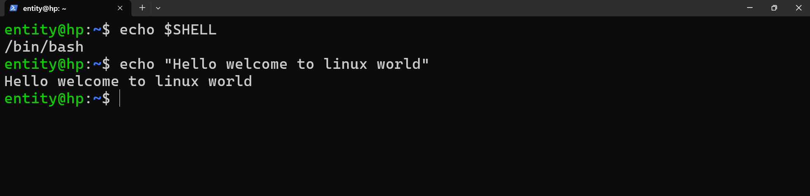

# React and Respond 

### in any situation we need to learn how to respond not to react.

# Commands

## What is command?

* we can ineract with any server with commands

* command-name  (What to do )
* command-name option (How to do )
* command-name options arguments  (on what to do )

*  `echo` - Prints whatever you have given 

*` pwd` - Present working directory

* In windows we call folder 
* In windows we call folder as `Directory`

* ls - To list the content 
    * ls -l -> To list directory content
    * ls -a -> To list hidden content
    * ls -h -> to list content with human readable 
* To learn more about ls command 

* commands with option

   * ls -a /etc/
   * ls boot/
   * ls -l boot/
   * ls sbin
   * ls /opt/
   * ls home/
   * ls -lh /etc/ssh/

## what is hiddenitem 

in linux any hidden can start with `.`

## whoami - to check who is the use login 

## touch - to creat files or empty we can we use command

## cat - To read the files 

# In linux we multiple terminal 

we have multiple screens 
- TTY/Terminal session

to change/switch terminal 

`chvt <terminal number>`

ctrl+alt - F1
ctrl+alt - F2
............F3 , F4, F4 
ctrl+alt - F6 

* who
     * who -a
     * who -b 

* w 

* uptime 

## runlevel  

*  init <runlevel>

init 0 -- poweroff/stop  -> runlevel1 
init 1 -- rescue
init 2 --
init 3 -- non gui 
init 4 --
init 5 -- gui 
init 6 -- reboot/restart -> runlevel6
