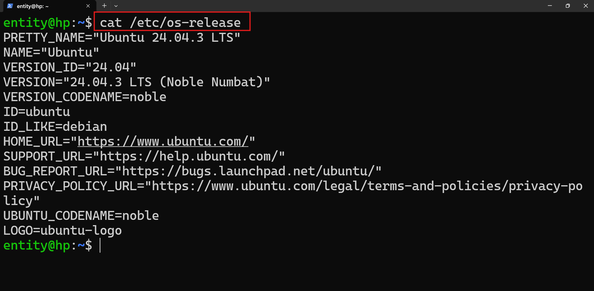
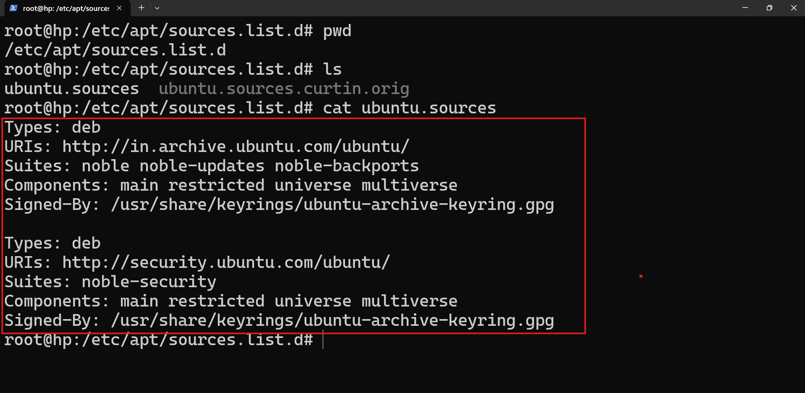

## Package Managers 

* linux systems are not allowing any softwares simply, they are controlling softwares whenever installing into a machine. 

* in windows package manager is `winget` 

* we can install software packages in linux distributions.
    * debian-> UBUTNU, DEBAIN , KALI  
    * RHEL -> REDHAT, ROCKY, CENTOS

* For Debian family the package managers in `.deb`
* For RedHat family the package managers in `rpm`

## What is a package manager 
* A package  manager can download and install a software package.
* a package contains 
    * configuration file
    * libraries 
    * dependecies


* For debian the package manager is `apt, apt-get`
* For redhat family package manager is `yum, dnf`

* we can install package 
    * upgrade
    * update
    * remove
    * query all the packges 

* To install tree software package 
`sudo apt install tree`

* what `apt remove` help to uninstall the software package.

* what is `apt purge`  help to uninstall and remove configuration files related to the software package. 

 to check the system information. 

configuration file responsible for installing software packages. 


# we can install softwares 
 * python 
 * java
 * nodejs 
 * in kali we have 600+ security tools.

 * how apt is installing software
 * pull the software package--> download --> dpkg(tool) --> for installing package.
 * apt/apt-get - is a smart tool
 * dpkg - worker tool 

* if you get command then you can install it
```bash
root@hp:~# ls
apple.txt  filepermission
root@hp:~# locate apple.txt
Command 'locate' not found, but can be installed with:
apt install plocate
root@hp:~#
```

* To install run the command `apt install plocate -y`
    * `-y` means --> yes install witout interption.

## command `locate`

```bash
root@hp:~# locate apple.txt
/home/entity/apple.txt
/home/entity/inodenumber/apple.txt
/home/rama/apple.txt
/root/apple.txt
/root/filepermission/apple.txt
root@hp:~# locate ubuntu.source
/etc/apt/sources.list.d/ubuntu.sources
/etc/apt/sources.list.d/ubuntu.sources.curtin.orig
root@hp:~#
```

## How to update software packges 

* `sudo apt update -y` 

## To check what are the sofwares can be updated
* `apt list --upgradable`
* apt upgrade --> to upgrade all the packges

## For redhat family, what is the package manager
* yum/dnf 

 
## prompts 

```bash
you are an expert in linux
i am a begginer in linux, i want to understand about file permissions.
i am learning cybersecurity for me give me some real time explantions to understand better about file permissions
i want to do some exercises once i unerstand the concept.
```
```text
you are an expert in cybersecurity,
i am learning cybersecurity, i heard that linux is no need for me is it real or not
```

```text
you are an expert in linux having 15+years of experince,
i am a begineer i want to understand package managers
i am not good from the basics, so can you teach from scratch
if needed give me in tabularform explantion.
```
## link files
```text 
you are an expert in linux having 15+years of experince,
i am a begineer i want to understand link files
i am good linux basic commands, but how can i use these link files in reallife/enterprise level in cybersecurity point view.
```

* To soft link (shortcut)
    * `ln -s apple.txt newapple.txt`

* let's hard link (creating another file/renaming file)
* ln <filename> <linkname>
`ln salary.txt copy_salary.txt`
* it is a renaming a file
* both files have same inode number
* if one file delete other file can't effect

## exercise

* if you want a **copy** of a file will you create softlink or hardlink.
* if you want a **shortcut** of a file will you create softlink or hardlink.