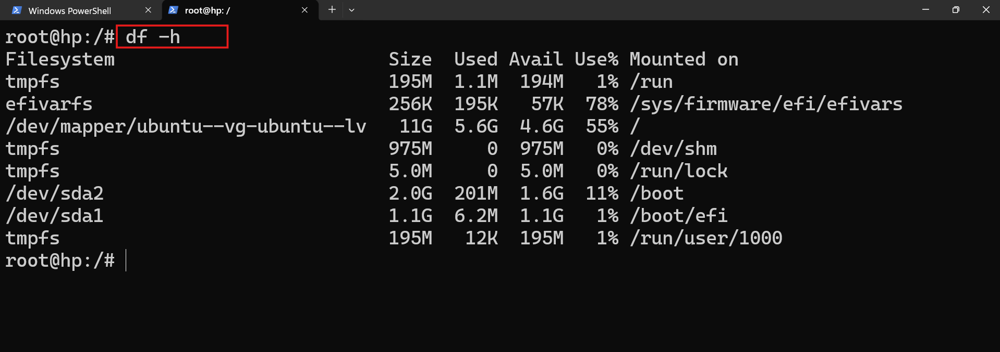

# storage and disk management 

* what is storage ? long term purpose 
* what is disk? 
     * HDD
     * SDD

* what is partion?
* what is mount?

* lsblk --> list block devices

```bash
root@hp:~# whatis free
free (1)             - Display amount of free and used memory in the system
free (3)             - allocate and free dynamic memory
```
* what is disk?
* in linux every disk is going to map to a folder this is called mounting. 
* we are creating folders and those folders we are going to map to disk

* df -h



* du -sh

* what is file system? 
 * To orgainise 
 * To isoalte

 * we can't store any data in the disk.

 ## lookup --> what are ext2/ext3/ext4 and xfs 
 
 *  each file system has different way organisation 

* what is our concern
* To avoid fail
    * monitoring 
    * system crash
    * log verfication


# Explore
##  find command

```bash
act like a linux terminal i am a beginner in linux, i want to explore command find with options and usecases
```
* sed
* awk
* cut 
* sort 
* in linux what is asterisk `*` for matching all the patterns. 


## for redhat family we can login with root
* package manager for redhat family is `yum/dnf`
* to update the packages ` yum update -y`
* to install sofware `yum install tree`
* to install software webserver
    * apache in ubuntu
    * httpd in redhat
    * nginx in both ubuntu and debian

```bash
yum install httpd -y
yum install nginx -y
```

## command `systemctl`
```bash
[root@localhost ~]# whatis systemctl
systemctl (1)        - Control the systemd system and service manager
[root@localhost ~]# systemctl start httpd
[root@localhost ~]# systemctl enable httpd
Created symlink /etc/systemd/system/multi-user.target.wants/httpd.service → /usr/lib/systemd/system/httpd.service.
```


### exercise 
* commands 
    * wget 
    * curl 