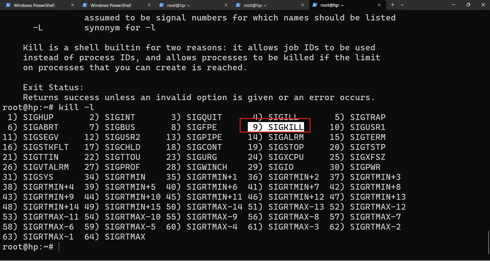

## Installing kali 
[Refer Here](https://www.kali.org/) for kali linux official. 

## Process management

* what is process?
* what is program? 


```text
user --> shell --> kernel --> process --> output
```

* fork() -- a child process will create


* ps
* top
* htop

```bash
you are an exert in linux shell, i am a beginner i want to undestand linux commands. so, whenever i give a command you should explain it from the scratch
```

* what is PID?

## kill
* kill doesn't mean killing
* it is going to send signal to the process



## explore 
* nice 
* renice 


### jobs 
[play ground](https://crontab.guru/) for cron job

* cron
* at 
