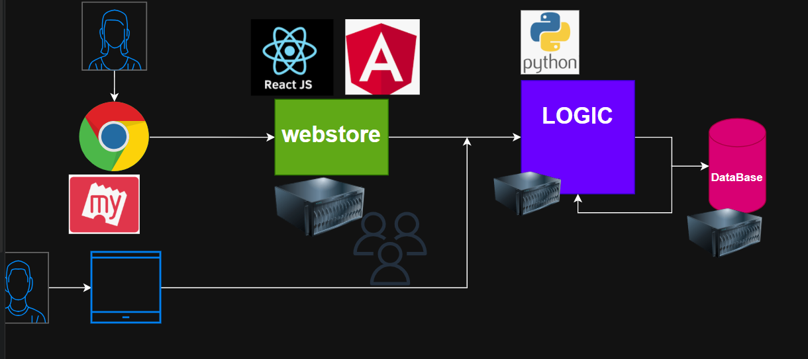
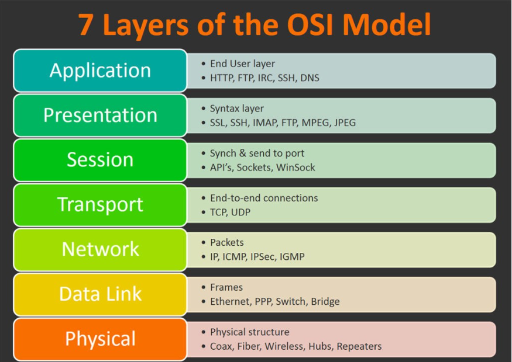
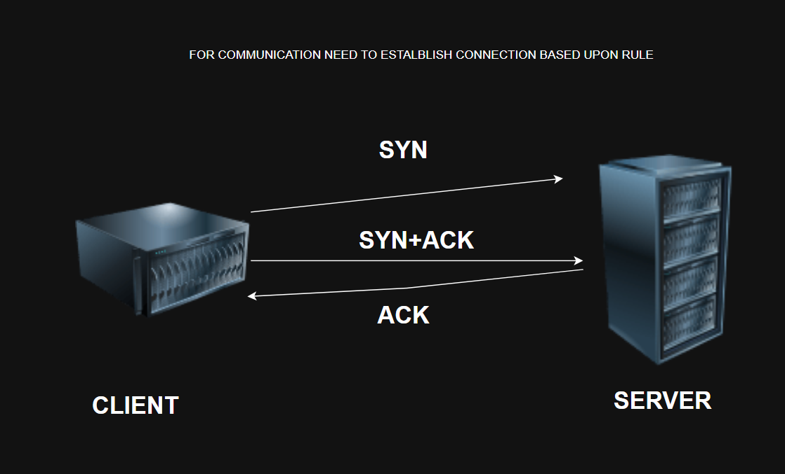
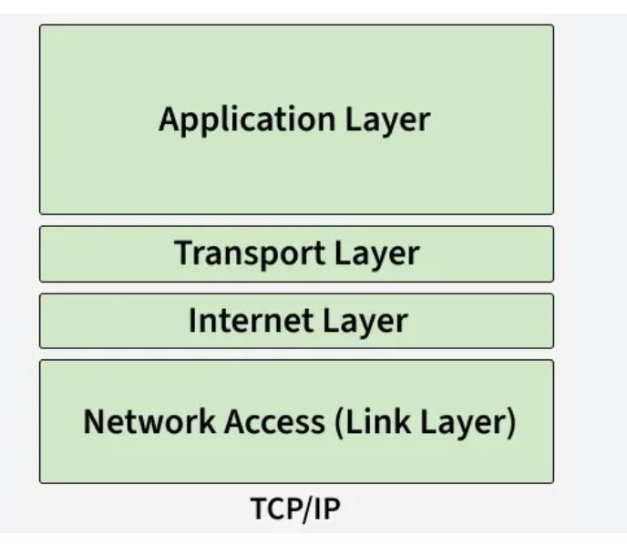

# Networking



* What is Networking? 


* How these mahcines are going to establish communication.
* we have defined `setof protocols` which was deployed with operating system.

* What is protocol?
     * set of rules 

* for connection between servers 
    * OSI refernce models(Learning purpose)
         * we have 7 laers 
            * A P S T N D P 
            

* CONNECTION ESTABLISHED B/W CLIENT AND SERVER


    * TCP/IP refernce model

## TCP/IP refernce model

```bash
 you are an expert in networking and OSI AND TCP/IP PROTOCOLS 
I am a beginner i want to understand from the scratch
```

* four layers 
    *  


* what is IP(internet protocol)? 

* we are in niligiri block
* for a machine to communicate there is unique id that is IP Address. 

### explore
## what is MAC Address? 

## 32 bit 
## 128 bit

```text
private ranges 
10.0.0.0 → 10.255.255.255
192.168.0.0 → 192.168.255.255
172.16.0.0 → 172.31.255.255
```

* `default gate way` is (door/entry point) for a system to connect the internet. 

* what is host?
* to change hostname to a there is a command is `hostnamectl`
`sudo hostnamectl set-hostname qualitythought`
* to check system name `hostname`
* to get ip address `hostname -I`

## ports 
* what are ports? 
* in any system we have ports to allow into the internet/external word. 

* https (443)
* http(80)
* ssh(22)
* dns domain name (53)
* database mysql (3306)
* ftp (21)
* webservers (apache/nginx- 80)
* tomcat application server - 8080 


### what is loopbak funtion(127.0.0.1) --> explore

## ssh
* ssh stands for secure shell protocol

    * port number - 22
    * configuration file - /etc/ssh/sshd_config
    * for logs - /var/log
    * service name - sshd

## how to establish connection b/w two servers?
