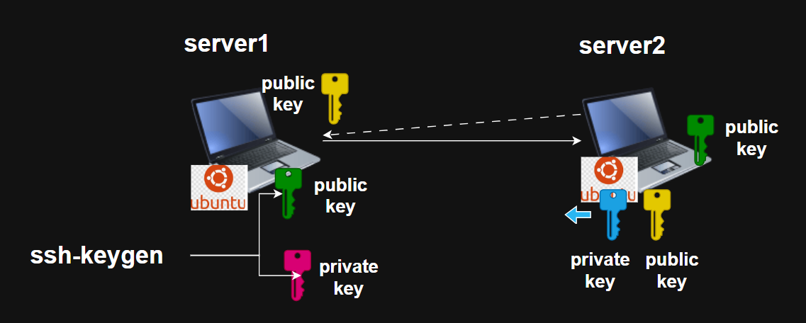
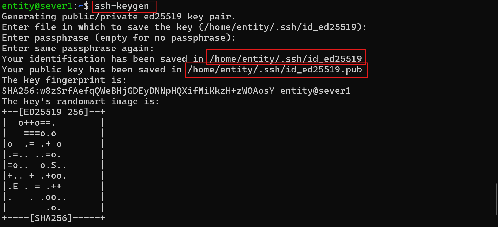
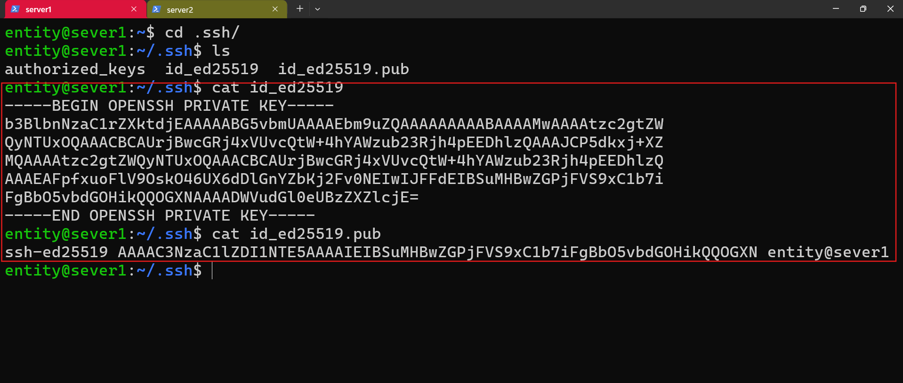
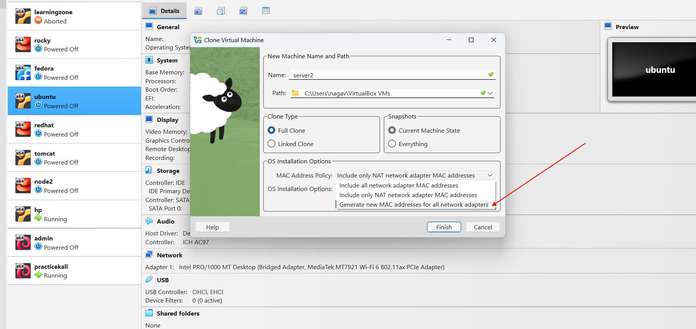

## Installing kali os machine

# how to establish connection b/w two servers?

* How we are going to connect any server.
    * username 
    * password

* with `keys` we can make connections
    * we can make connections 
        * password authentication
        * password less authentication

* What are **sshkeys**?
    * rsa (older)
    * ed25519 (newer)
* these alogorithem gives two combination keys
    * public key 
    * private key

# How to generate sshkeys(public and private)? 

* default directory for storing sshkeys is `.ssh`

* watch classroom recording for understandin copying publickey to sever2.

## what is cloning?

