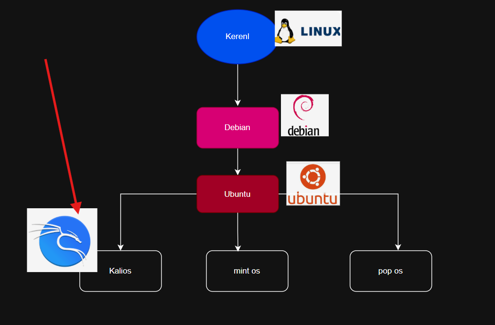
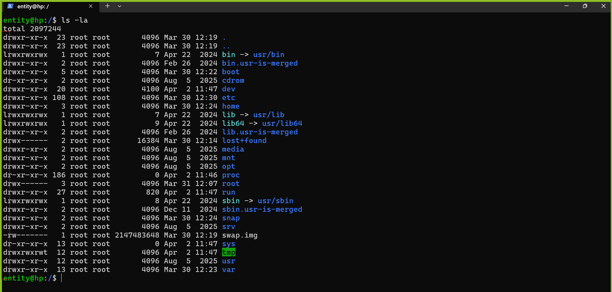
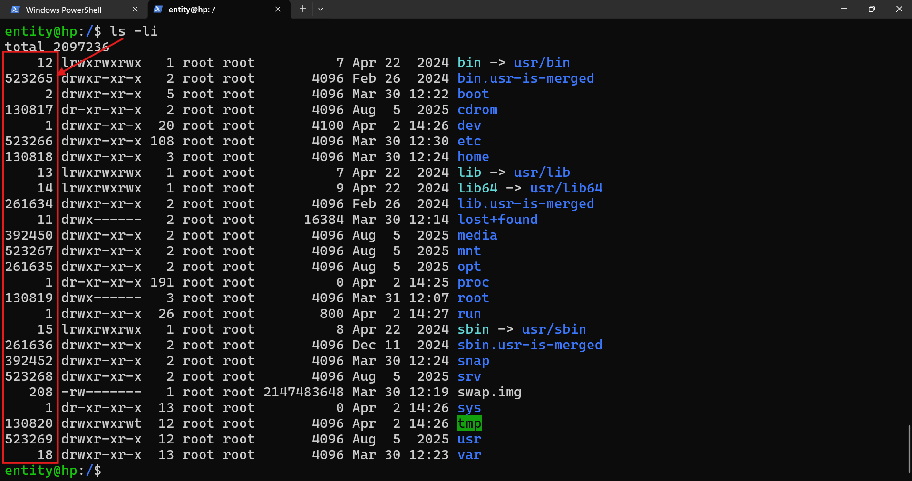
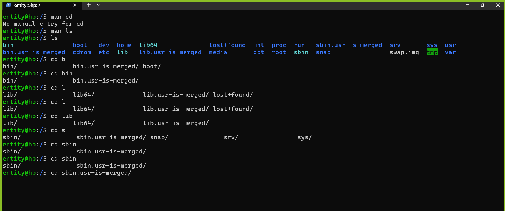

# LINUX

[REFER HERE](https://www.debian.org/) FOR DEBIAN 

[Refer here](https://ubuntu.com/) for ubuntu. 




os -> kernel -> filesystem -> commands


# one hacker deleted one file 
* `salary.txt` (Deleted)
* again created `salary.txt` samefile (but it has malicous)

# Types of files 

* They are different types of files

* Everything is a file

    * regualar files 
    * directory files
    * link files
    * block files
    * socket files
    * pipe files
    * character

    


## system information

* uname -a To check the system  information

* <command name> --help

* man - one page description
* info - total documentation

     * q to quit from man and info commands

* whatis - it gives one info about the command


## how to close the user session  -> `ctrl + d`


## about . and ..
        . is current directory
        .. is parent directory


## exercise 

what is the use  of `ls -i` 

`i` stands inode number 




file name is like `name` in adhar
inode number is `adharnumber` 

- Linux is good tracking inode numbers 


* cd - change directory


* tab keyword can use for `switching` and for` autofill`



* adiminstration.txt   512654  - > delted

* now he added one more file adiminstration.txt 46545


```bash
drwxr-xr-x  23 root root       4096 Mar 30 12:19 .
drwxr-xr-x  23 root root       4096 Mar 30 12:19 ..
lrwxrwxrwx   1 root root          7 Apr 22  2024 bin -> usr/bin
drwxr-xr-x   2 root root       4096 Feb 26  2024 bin.usr-is-merged
drwxr-xr-x   5 root root       4096 Mar 30 12:22 boot
dr-xr-xr-x   2 root root       4096 Aug  5  2025 cdrom
drwxr-xr-x  20 root root       4100 Apr  2 11:47 dev
drwxr-xr-x 108 root root       4096 Mar 30 12:30 etc
drwxr-xr-x   3 root root       4096 Mar 30 12:24 home
lrwxrwxrwx   1 root root          7 Apr 22  2024 lib -> usr/lib
lrwxrwxrwx   1 root root          9 Apr 22  2024 lib64 -> usr/lib64
drwxr-xr-x   2 root root       4096 Feb 26  2024 lib.usr-is-merged
drwx------   2 root root      16384 Mar 30 12:14 lost+found
drwxr-xr-x   2 root root       4096 Aug  5  2025 media
drwxr-xr-x   2 root root       4096 Aug  5  2025 mnt
drwxr-xr-x   2 root root       4096 Aug  5  2025 opt
dr-xr-xr-x 183 root root          0 Apr  2 11:46 proc
drwx------   3 root root       4096 Mar 31 12:07 root
drwxr-xr-x  28 root root        860 Apr  2 12:32 run
lrwxrwxrwx   1 root root          8 Apr 22  2024 sbin -> usr/sbin
drwxr-xr-x   2 root root       4096 Dec 11  2024 sbin.usr-is-merged
drwxr-xr-x   2 root root       4096 Mar 30 12:24 snap
drwxr-xr-x   2 root root       4096 Aug  5  2025 srv
-rw-------   1 root root 2147483648 Mar 30 12:19 swap.img
dr-xr-xr-x  13 root root          0 Apr  2 11:47 sys
drwxrwxrwt  12 root root       4096 Apr  2 12:32 tmp
drwxr-xr-x  12 root root       4096 Aug  5  2025 usr
drwxr-xr-x  13 root root       4096 Mar 30 12:23 var
```


```bash
drwxr-xr-x   3 root root       4096 Mar 30 12:24 home
drwxrwxrwt  12 root root       4096 Apr  2 12:32 tmp
```
```bash
for home
rwx --> user
r-x --> group
r-x --> others

form tmp

rwx --> user
rwx --> group
rwx --> others

```
```bash
r - read
w - write 
x - execute 
```
* giving permissions


```text
you are an expert in IT
i am a soc analyst
i want to know what teams are in any software company
```

* if hacker added some malicous info to the existing, now how we can check

### what is hash?