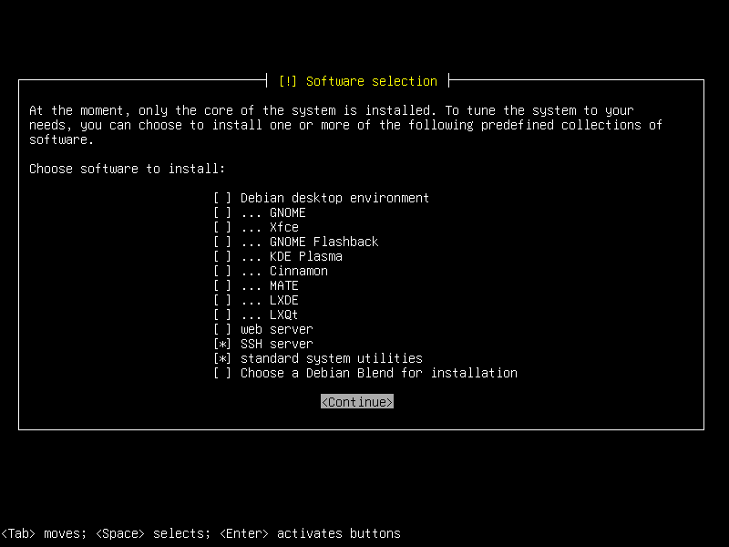
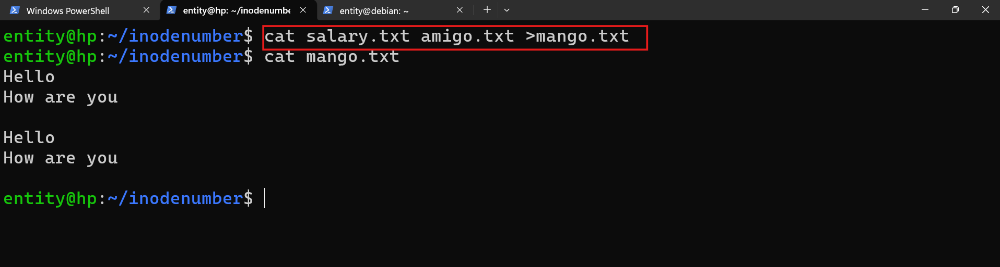

# Inode number 
* can describes the metadata
     * user
     * group
     * ownership

* what

```bash
ls -i
```


* anything start `-` it is regular file 

* Linux Case Sensitive....

```bash
touch Apple.txt
touch APPle.txt
toutch APple.txt
```
* we have 3 apple files, these 3 are different because linux case sensitive. 

```bash
entity@hp:~/inodenumber$ ls -lai
total 8
130873 drwxrwxr-x 2 entity entity 4096 Apr  3 11:40 .
130846 drwxr-x--- 7 entity entity 4096 Apr  3 11:39 ..
165410 -rw-rw-r-- 1 entity entity    0 Apr  3 11:39 amigo.py
165407 -rw-rw-r-- 1 entity entity    0 Apr  3 11:39 amigo.txt
165411 -rw-rw-r-- 1 entity entity    0 Apr  3 11:40 salary.txt
```

amigo.txt --> inode number is `165410`
let's some data in amigo.txt


# Installing Debian in oracle vitual box 



* non-gui select as shown in above image`(standard system utilities)`
* for `gui` select Debian `Desktop Enviroment` and `GNOME`


* To choose option click with `spacebar`

## For enterprise
* we have 
    * RedHat

```
Before 2020
Fedora -> RHEL(Redhat enterprise linux)-> CentOS  -> Rocky/Alma (old)

after 2020
Fedora -> Centos stream -> RHEL(Redhat enterprise linux) -> Rocky/Alma )(Newer)
``` 

* For learning - Rocky -> It replicates `Redhat`

* for any server, it has different types modes 

     * NAT adapter - only internet access. 
     * Bridge adapter - internet and communication with ohter servers

* your trt to setup debain vm


## Rocky linux 

[Refer Here](https://rockylinux.org/)


## commands
* cat command can be used form append(add) the data or override the data.
    * cat command can do concatenate(merge->newfile)

* cat - To view content any file
    * we can append the data 
         * To save `ctrl+d`

### To append the data follow as shown in below 

```bash 
entity@hp:~/inodenumber$ cat salary.txt
Hello
entity@hp:~/inodenumber$ cat >>salary.txt
we are learning cybersecurity
entity@hp:~/inodenumber$ cat salary.txt
Hello
we are learning cybersecurity
entity@hp:~/inodenumber$ cat >>salary.txt
we are in 515 room  number
```


### To override the data follow as shown in below
```bash
entity@hp:~/inodenumber$ cat salary.txt
Hello
we are learning cybersecurity
we are in 515 room  number
entity@hp:~/inodenumber$ cat >salary.txt
the quick brown fox jumps over the lazy dog
entity@hp:~/inodenumber$ cat salary.txt
the quick brown fox jumps over the lazy dog
entity@hp:~/inodenumber$
```

* To concatenate two files into a new file we are using cat command




### Editor tools

* nano
* vi/vim

* nano - Text editor
    * To save `ctrl+d` press `enter`
    * To exit `ctrl+x`

* vi/vim
* vi has 3 modes 
    * command mode 
    * insert mode (To enter into mode press `i`)
    * execute mode ( first go to command mode -> press `ESC` Later press `shift+:`(now you are in execute mode))


* To save and quit `:wq`
* To save and quit forcefully: `wq!`

* To quit without saving `:q`
* To quit forcefully `:q!`

## How to crate directory

* To create directory command `mkdir` 
* identity of directory showed by `d`

* To create nested folder use option `-p` 

```bash
To create directory
mkdir projectnew

To create nested directories 
mkdir -p projectnew/makemytrip
```
