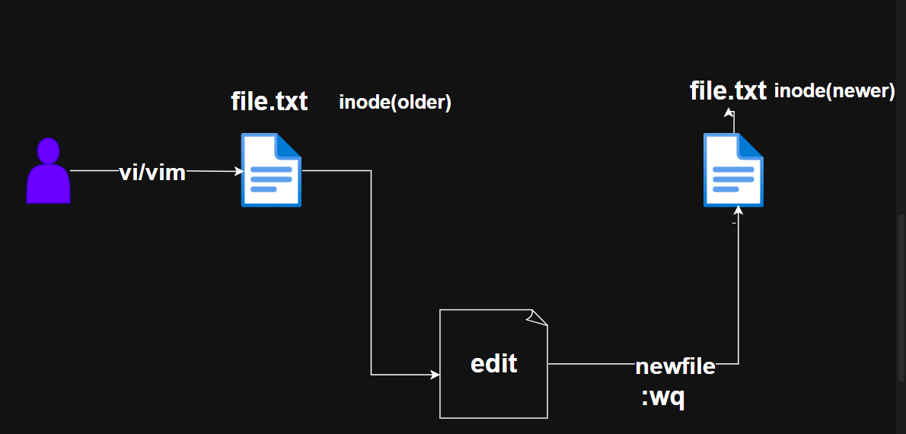
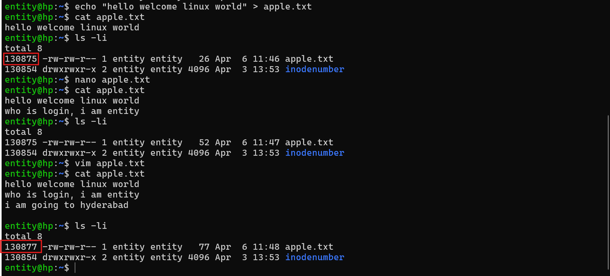

## linux contd

* if you are trying make changes over vi/vim in a file, at that moment if system crash, vi/vim can help us with backup file. 



* olderfile is replaced with newfile, so that inode number has changed. 




## speak and listen and if any thing is not good you are make complain.
* stdin(0)
* stdout(1)
* stderr(2)

## let's some more commands alternatives to view content

### head
```bash
head <filename>
```
* to view first 10 lines of any file

* to view first 25 lines of any file
```bash
head -n 25 <filename>

### tail
* syntax
```bash
tail <filename>


* to view last 10 line of any file we are going to use `tail`
* to view last 20 lines of any file 
```bash
tail -n 20 /etc/ssh/ssh_config
```
* when ever users are hitting servers, it is going collect logs, to check stramed logs
```bash
tail -f /var/log/syslog
```

### more
* to view content page by page 
```bash 
more <filename>
```

### less 

* less adavanced version of more command
```bash
less <filename>
```
* To view any file like a document can be used
* can search any word here
    * press `/` and `enterwhich you wanted find` and press `enter`

## How to rename a file/directory and move a fil/directory

* we can rename a file/directory with `mv` 
* we can move a file/directory to a folder wiht mv
```bash
mv <filename> <newname>
mv <source> <dest>
```
## operators

There are 4 opeator
* stdin(<)
* > 
* append(>>)
* error(2>)
* output and error(&>)


## how to multple commands 
* with help of `colon ;` we can run multple commands
 `whoami;w;who;whatis ls`

* to run multiple command print the ouput in a file
* use `( )`
```bash
(whoami;w;who;whatis ls)
(whoami;w;who;whatis ls;cmd) 2> outpu.txt
```

## How to remove file/directory

* To remove an empty directory 
```bash
entity@hp:~$ mkdir project
entity@hp:~$ cd project/
entity@hp:~/project$ ls
entity@hp:~/project$ cd ..
entity@hp:~$ ls
amigo      file10.txt  file3.txt  file6.txt  file8.txt    mango.txt   project
error.log  file2.txt   file5.txt  file7.txt  inodenumber  output.txt
entity@hp:~$ rmdir project/
entity@hp:~$ ls
amigo      file10.txt  file3.txt  file6.txt  file8.txt    mango.txt
error.log  file2.txt   file5.txt  file7.txt  inodenumber  output.txt
```
To delete nested directories recursively

```bash
entity@hp:~$ mkdir -p project/swiggy/food
entity@hp:~$ ls
amigo      file10.txt  file3.txt  file6.txt  file8.txt    mango.txt   project
error.log  file2.txt   file5.txt  file7.txt  inodenumber  output.txt
entity@hp:~$ tree project/
project/
└── swiggy
    └── food

3 directories, 0 files
entity@hp:~$ rm -r project/
entity@hp:~$ ls
amigo      file10.txt  file3.txt  file6.txt  file8.txt    mango.txt
error.log  file2.txt   file5.txt  file7.txt  inodenumber  output.txt
```


### exericise

* what are 
    * .bashrc
    * /etc/profile 
