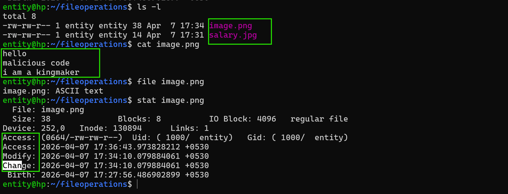
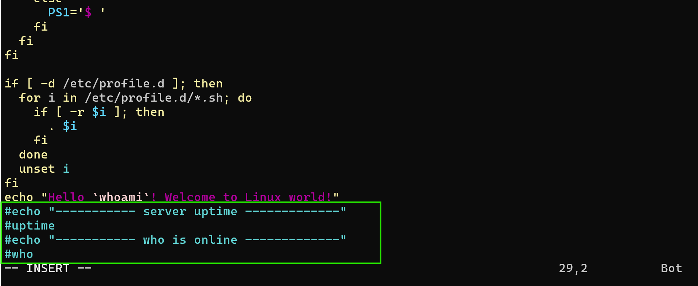

## commands contd

### Detecting fake files and analysing files

* file <filename>

```bash
entity@hp:~/fileoperations$ echo "i am a hacker" >> salary.jpg
entity@hp:~/fileoperations$ file salary.jpg
salary.jpg: ASCII text
```

* as security engineer don't believe any file by it's name 
check with `file` command.

* stat command can help us to check 
     * atime
     * mtime
     * ctime
     * metadata(user permissions,etc)



* if we want to change any file, before that we need to take backup

* cp - To copy files
* To explore more about cp command 
    * do `cp  --help`

```bash
entity@hp:~$ cp fileoperations/ backup/
cp: -r not specified; omitting directory 'fileoperations/'
entity@hp:~$ ls -l fileoperations/
total 12
-rw-rw-r-- 1 entity entity  38 Apr  7 17:34 image.png
-rw-rw-r-- 1 entity entity 435 Apr  7 17:41 output.txt
-rw-rw-r-- 1 entity entity  14 Apr  7 17:31 salary.jpg
entity@hp:~$ cp -R fileoperations/ backup/
entity@hp:~$ ls backup/
fileoperations
```

* How to check a file has  how many `line`, `words` and `characters`

* wc(word count)

```bash
entity@hp:~$ wc file10.txt
0 0 0 file10.txt
entity@hp:~$ echo "linux is powerfull">file10.txt
entity@hp:~$ wc file10.txt
 1     3       19        file10.txt
line  words  charcters
```

* in characters it will calculate spaces too.

* options

    * -l - for line numbers
    * -w - for words
    * -c - for storage bytes
    * -m - characters

### pipe `|` 

* what pipe can do, it will pass first command of output to next command as input.

```bash
entity@hp:~$ cat /etc/ssh/sshd_config | grep Banner
#Banner none
```
### alias
* what is alias is fake name or another name
```bash
entity@hp:~$ alias hack='cd inodenumber'
entity@hp:~$ hack
entity@hp:~/inodenumber$ alias i='whoami'
entity@hp:~/inodenumber$ whoami
entity
entity@hp:~/inodenumber$ i
entity
```
* if you create ailas with the command, it is only for the session. 

* To make alias permanent

### shell configuration files
* `.bashrc or bash.bashrc` for user level
* `/etc/bashrc or /etc/bash.bashrc` for systemlevel
* `/etc/profile` to run commands
* `/etc/enviroment`  (we will learn upcoming classes)

* what are shell configuration file
     * creata alias
     * run commands
     * customise terminal
     * run enviroment variables

* shell configuration files are classified into two types
    * user level configuration
    * system level configuration


* alias qt='ls -liht' only for active session

* for **user level configuring aliases**, we have a configuration file `.bashrc`

* when ever if you change anything in shell configurtion file, run the command `source` 
`eg: source .bashrc`


* To make **system level aliases** (become root user)
/etc/bashrc or /etc/bash.bashrc

```bash
root@hp:/etc# vim bash.bashrc
root@hp:/etc# source /etc/bash.bashrc
root@hp:/etc# cd
root@hp:~# i
root
root@hp:~# whoami
root
```

## To run commands or to create banners while login into screen
shell configuration file `.profile` for system wide
* shell configuration file `/etc/profile` for system wide
* edit shell file and add commands to it at last line.
* save the file 
* run `source /etc/profile`

```bash
entity@hp:~$ sudo -i
[sudo] password for entity:
Hello root! Welcome to Linux world!
----------- server uptime -------------
 18:31:03 up  1:04,  4 users,  load average: 0.11, 0.10, 0.03
----------- who is online -------------
entity   tty1         2026-04-07 17:26
entity   pts/0        2026-04-07 18:08 (192.168.68.104)
entity   pts/1        2026-04-07 18:24 (192.168.68.104)
entity   pts/2        2026-04-07 18:30 (192.168.68.104)
entity   pts/3        2026-04-07 18:31 (192.168.68.104)
root@hp:~#
```

* How to remove aliases 

    * for temporary aliases 
         `unalias <aliasname>`
    * for permanent aliases 
        * we can remove line from shell configurations
        * we can make unused by adding `#` in the beginning of line.




* then do source <configutation filename>


