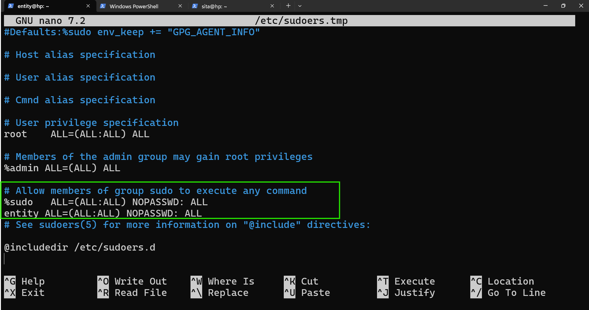
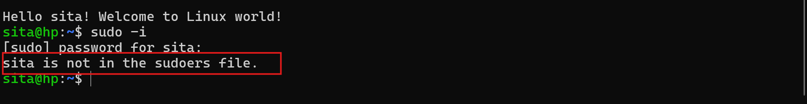
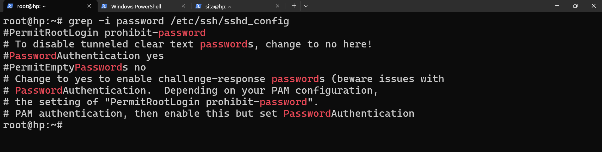

## users and management
* for linux system, it has multiple users 
    * system users 
    * regular/standard users
* special user also called superuser is `root`

### for system, how many users can create.
* a system allows 0 - 60,000 users
* 0 is root user
* 1 - 999 are system users
* 1000 - 60000 are standard/regular users.

* what is 0 is an unique id (UID)

```bash
entity@hp:~$ whoami
entity
entity@hp:~$ id
uid=1000(entity) gid=1000(entity) groups=1000(entity),4(adm),24(cdrom),27(sudo),30(dip),46(plugdev),101(lxd)
entity@hp:~$
```

## To create user
    * useradd <username>
    * adduser <username>

```bash
entity@hp:~$ adduser amigo
fatal: Only root may add a user or group to the system.
entity@hp:~$ sudo adduser amigo
[sudo] password for entity:
info: Adding user `amigo' ...
info: Selecting UID/GID from range 1000 to 59999 ...
info: Adding new group `amigo' (1001) ...
info: Adding new user `amigo' (1001) with group `amigo (1001)' ...
info: Creating home directory `/home/amigo' ...
info: Copying files from `/etc/skel' ...
New password:
Retype new password:
passwd: password updated successfully
Changing the user information for amigo
Enter the new value, or press ENTER for the default
        Full Name []: quality thought
        Room Number []: 515
        Work Phone []: 123456789
        Home Phone []: nilgiri
        Other []: cybersecurity
Is the information correct? [Y/n] y
info: Adding new user `amigo' to supplemental / extra groups `users' ...
info: Adding user `amigo' to group `users' ...
```

### To check the user information we have configuration files
    * /etc/passwd - user details

    * /etc/shadow - secure info

### in linux system we can have groups for users.
# To create groups for users 
    * groupadd <groupname>
* To explore more `groupadd --help`

## How to change a user permisions
```bash
entity@hp:~$ sudo usermod -L amigo
```
To lock the user we can run the above command

## To delete useraccount 

* userdel <username>
* userdel --help

### To set password for any user
* we have 
    * chage -> password policy
    * passwd -> password change

```bash
entity@hp:~$ sudo passwd rama
New password:
Retype new password:
passwd: password updated successfully
```

```bash
entity@hp:~$ sudo chage -l rama
Last password change                                    : Apr 09, 2026
Password expires                                        : Jul 08, 2026
Password inactive                                       : never
Account expires                                         : never
Minimum number of days between password change          : 10
Maximum number of days between password change          : 90
Number of days of warning before password expires       : 7
```
* for password: a-z, A-Z, Special words, numbers etc..

### shells 
* How to check shells
* cat /etc/shells
```bash
rama@hp:~$ cat /etc/shells
# /etc/shells: valid login shells
/bin/sh
/usr/bin/sh
/bin/bash
/usr/bin/bash
/bin/rbash
/usr/bin/rbash
/usr/bin/dash
/usr/bin/screen
/usr/bin/tmux
```
* there are users without shells, those users used for services or process. 
* prompt for exploring users in linux system. 
```text
you are an expert in system users and regualr users. give me example of users and shells in tabular form
```

* chsh -s /bin/sh <username> -> to assign sh shell to user.


* compgen -u -> to list all the users 
* compgen -g -> to list all the groups


* exericise:
what are `/etc/group and /etc/gshadow`

### su and sudo 
* su - substitute user
* sudo - to run a user with admin privliges .
```bash
entity@hp:~$ whatis su
su (1)               - run a command with substitute user and group ID
entity@hp:~$ whatis sudo
sudo (8)             - execute a command as another user
```
* su can help us to switch from one user to another user.

* `su -` --> it will open root user 
* `su - sita` --> it will open sita user 


* ### sudo 
* if you want to make a user as admin we have run commands with sudo.

### How to make a user as sudo user 
* in debian family : sudo group 
* in redhat family : wheel group 

* we need add user to the group 
* To add a user into sudo group we have to give user details in suodoers file



* if the user is not in sudoers group it will show as like in the below image


* for not asking password while chaning to root user/installing/actions/creating etc. add `NOPASSWD: `
```bash
entity@hp:~$ sudo -i
[sudo] password for entity:
Hello root! Welcome to Linux world!
root@hp:~# exit
logout
entity@hp:~$ visudo
visudo: /etc/sudoers: Permission denied
entity@hp:~$ sudo visudo
entity@hp:~$ sudo -i
Hello root! Welcome to Linux world!
root@hp:~#
```

### command 
*  grep command stands global regular experssion pattern.


* grep --help --> to explore.


