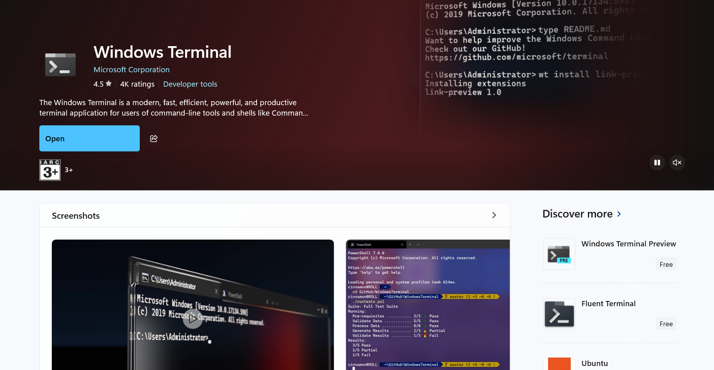
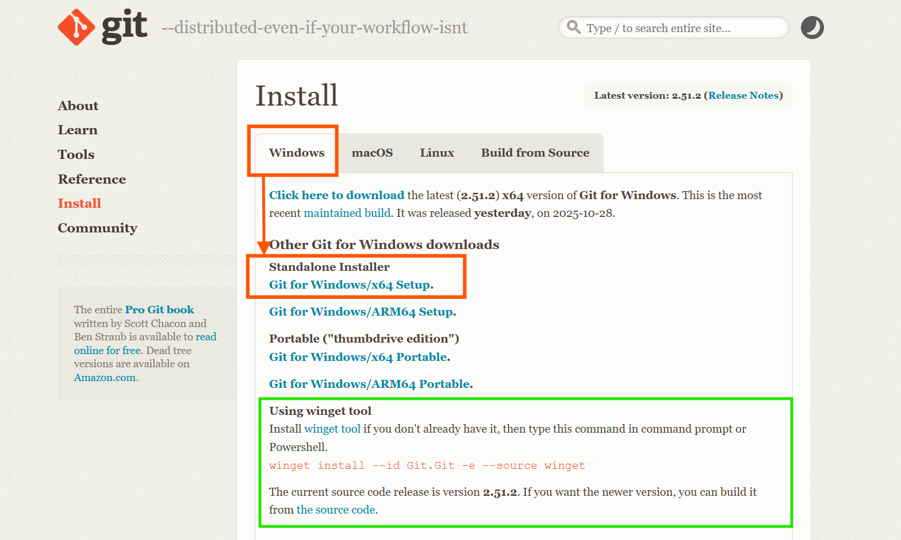
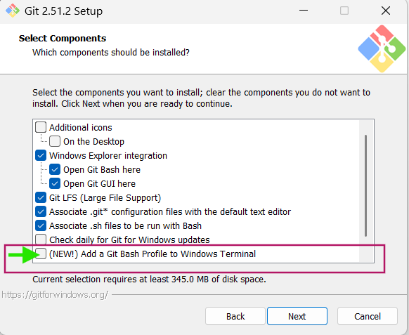

# Operting system

* in windows laptops we have windows os 
* mobile - android 


## os 
* user -the family 
* os - the person who is taking order
* hardware -kitchen


* 


### can we install two operating systems in a machine

# what is virtual machine

vm is software, it contains all the hardware information


# Hypervisor 

* two types 
     * Type1 - Baremetal 
        * for enterprises

     * Type2 - hosted 
        * for learning and development

### examples: 

| Type 1 Hypervisors                  | Type 2 Hypervisors |
| ----------------------------------- | ------------------ |
| VMware ESXi                         | VMware Workstation |
| Microsoft Hyper-V (bare metal mode) | Oracle VirtualBox  |
| Xen (Citrix Hypervisor)             | VMware Fusion      |
| KVM (Kernel-based Virtual Machine)* | Parallels Desktop  |


### which hypervisor we are going to use? 

* vmware workstation 
* oracle vitualbox (focus)-- Recomended; [Refer Here](https://www.virtualbox.org/) 

### for mac os users 
* vmware fusion 

## system setup

* Terminal (for windows10 users they need to install)


* [Refer Here](https://git-scm.com/install/windows) for `GitBash Download`



* while installing GitBash, add gitbash to terminal(as shown in the below image)


# wsl (windows subsystem linux)


# let's install oracle virtual box 

[refer here ](https://www.virtualbox.org/)


### Package manger 
* windows - winget  
* macos - brew 


#### To install virtual box over command line 
`winget install -e --id Oracle.VirtualBox`


## vmware
[refer here](https://www.broadcom.com/)

# How many of you good with windows system commands


## 
can you explore 
what are  these commands

* ls
* pwd
* cd 

```bash
Get-ChildItem # To list
start . #  To open file explorer
Get-Alias # To list all the commands in windows
```


## goal
* what is linux
* what is alias
### how to run your systems like a pro
### How to secure system.


