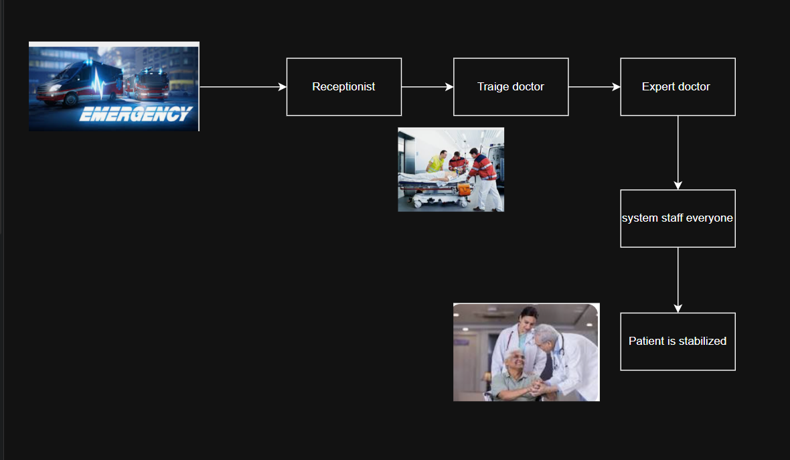
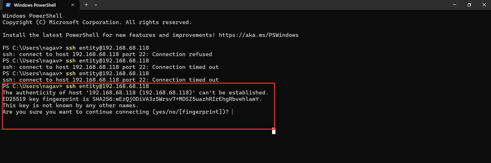
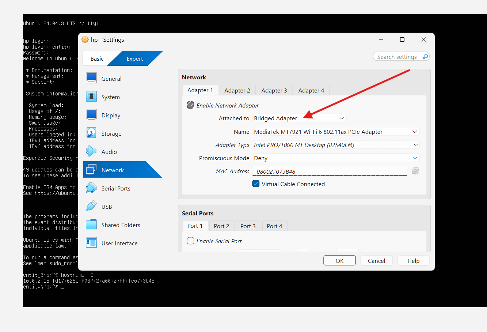
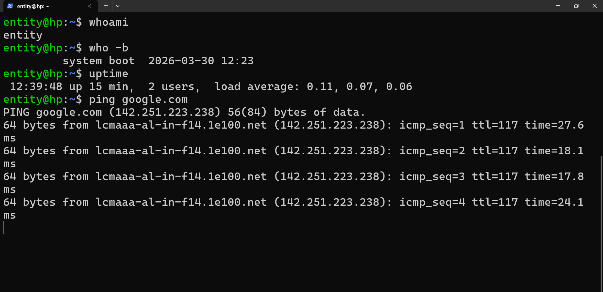

# Booting Process

* when we press the power button **system will dead**.

we system  has hardware

* RAM
* MEMORY(ROM)
* CPUS
* NIC
* DRIVERS 
* 

* FOR THAT TO RUN THE SYSTEM IT NEED BRAIN 

## Let's understand how hospital sysem is going to when an emergency case is there

* In a hospital at 02:00 AM, 

* In Booting process
 * UEFI  
 * BIOS

512 BYTES STORAGE 

SSYTEM WORKS OR NOT

* RAM
* MEMORY(ROM)
* CPUS
* NIC
* DRIVERS 

* what is kernel 

- Kernel is heart of the linux 

# what is kerenl

* process
* storage 
* manage
* package

what it is going to do 
it is going to talk with the system and it will give output us

* we are going to talk with kernel over terminal

# what is linux
## what is linux operating system

* linux kernel open source

* they have created 500+ linux distributions
    * Debian
    * ubuntu
    * Rocky
    * Redhat
    * Kali
    * fedora
    * suse

# How to setup ubuntu virtual mahcine

## Exercise

* what is the bootloader in windows
* what is the process?
* what is log?
* why it asking in the below image what is the meaning of it.

* 

# for any virtual mahcine we can have modes

*  NAT (IT ONLY HAS INTERNET CONNECTION)
* BRIDGE MODE (It has interent connection as well as it can talk with another machine)

# shell

* sh
* ksh
* bash(Bournge again shell)
* zsh

* shell is an intepreter between hardware and us

## To connect to remote sever

# now the system is alive

## we are going to learn about how to run your systems