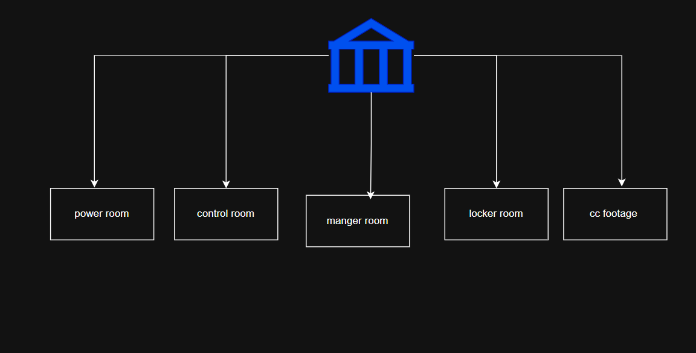
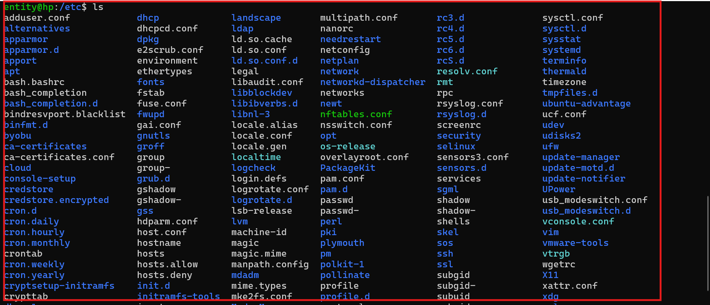
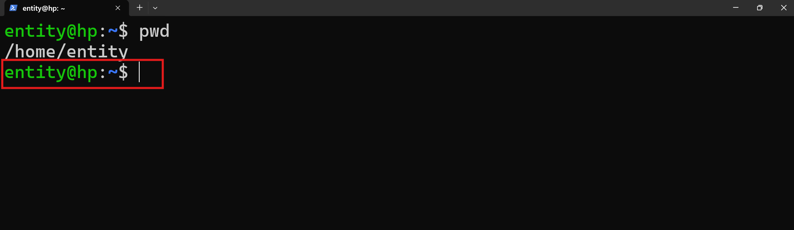

# story

## you are SOC ANALYST

* if one server got hacked, 
    * what will you do ? what will you check ?


* IF ALL ARE AT ONE PLACE ....! IT LOOKS CHAOS 

## In Bank  every thing organised



# Linux File system

|  Bank             | purpose               |   Linux          | 
|-------------------|-----------------------|------------------|
| main building     | starting point        |      /           | 
| powersupply       | starting              | boot             | 
| locker files      | user details          | home             |
| control room      | trackin               | etc              |
| cctv logs         | to find or trck       | var/log          |
| manager           | he control everything | roo              |
|--------------------------------------------------------------|


* / 

* boot  

* home 

* tmp

* etc 



* root 

* var 


## path

### what is path 

* full address
* current location address

* Realtive path (current address)
* absoulte path (full address)


entity@hp:~$ 

    * entity  - username 
    * @ - telling address
    * hp  - system name 
    * ~   - short cut for user location. 
    * $   - normal user
    * #   - root user 



# runlevels

    * 0   - halt/shutdown 
    * 1   - rescue 
    * 2   - 
    * 3   - cli 
    * 4   - 
    * 5   - gui
    * 6   - reboot 


### exercise 

* what are runlevel 2 and 4 

### LLM MODELS

* CHATGPT - PRO 
* CALUDE  - 
* PERPLXITY  - PRO
* Gemini-  pro 


```text
you are an expert in indian grand mother, i am your grand son, i am studying 8 th class i can't sleep without listening your stories can you explain me linux file sytem , so that i will sleep
```